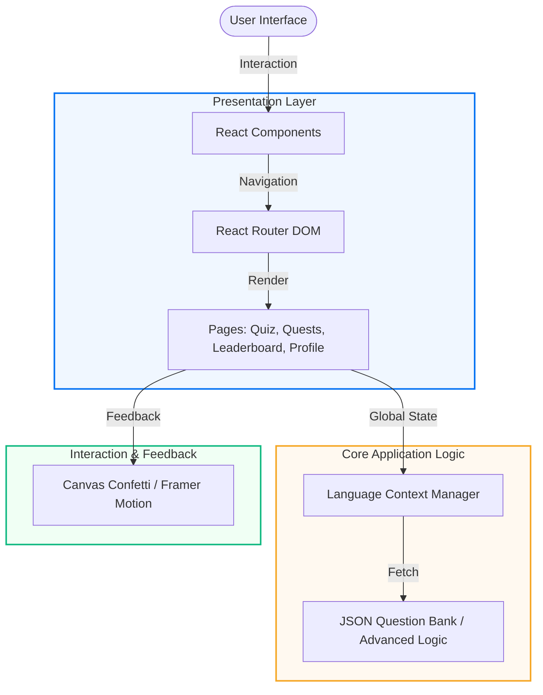

# 🗣️ Lingua Quest: Master Languages Through Play

[](https://reactjs.org/)
[](https://vitejs.dev/)
[](https://tailwindcss.com/)
[](https://opensource.org/licenses/MIT)

**Lingua Quest** is a next-generation, gamified language learning platform designed to make mastering new languages addictive and effective. It bridges the gap between casual vocabulary memorization and professional fluency through an immersive, interactive interface.

---

## 📝 Overview

Lingua Quest is built for the modern learner. By combining the power of **React 19** with **Framer Motion**'s fluid animations and **Tailwind CSS 4**'s utility-first styling, it provides a premium user experience that keeps learners engaged. The platform features an adaptive quest system, real-time leaderboard tracking, and a comprehensive user profile to monitor growth.

## 🏗️ System Architecture

The application follows a modular, component-driven architecture for maximum maintainability and performance.



## ✨ Key Features

- **🎯 Adaptive Quests**: Progress through levels ranging from basic greetings to complex professional terminology.
- **📊 Live Leaderboard**: Compete with other learners globally and climb the ranks in real-time.
- **👤 Detailed User Profiles**: Track your learning stats, achievements, and progress with beautiful visualizations.
- **⚡ High-Performance Quiz Engine**: Instant feedback on answers with micro-animations and celebratory effects.
- **🎨 Premium UI/UX**: A clean, modern interface with dark mode support and tactile interactions.
- **🌍 Regional Dialect Focus**: Specialized support for localized nuances and regional language variations.

## 📂 Project Structure

```text
lingua-quest/
├── src/
│   ├── components/    # Atomic UI components (Buttons, Cards, Modals)
│   ├── context/       # Global state management (User progress, Language)
│   ├── data/          # Comprehensive question banks (JSON based)
│   ├── pages/         # High-level route components
│   │   ├── Quiz.jsx        # Core learning interface
│   │   ├── Quests.jsx      # Progression map
│   │   ├── Leaderboard.jsx # Competitive rankings
│   │   └── Profile.jsx     # User statistics
│   ├── App.jsx        # Main routing and layout wrapper
│   └── main.jsx       # Entry point
├── public/            # Static assets and icons
├── vite.config.js     # Vite & Tailwind configuration
└── package.json       # Dependencies and scripts
```

## 🛠️ Tech Stack

- **Framework**: [React 19](https://react.dev/)
- **Build Tool**: [Vite 7](https://vitejs.dev/)
- **Styling**: [Tailwind CSS 4](https://tailwindcss.com/)
- **Animations**: [Framer Motion](https://www.framer.com/motion/)
- **Icons**: [Lucide React](https://lucide.dev/)
- **Navigation**: [React Router 7](https://reactrouter.com/)
- **Effects**: [Canvas Confetti](https://www.npmjs.com/package/canvas-confetti)

## 🚀 Getting Started

To get a local copy up and running, follow these simple steps:

1. **Clone the repo**
   ```bash
   git clone https://github.com/kartikshete/lingua-quest.git
   ```
2. **Install dependencies**
   ```bash
   npm install
   ```
3. **Start the development server**
   ```bash
   npm run dev
   ```
4. **Build for production**
   ```bash
   npm run build
   ```

## 👨‍💻 Author

**Kartik Shete**
- GitHub: [@kartikshete](https://github.com/kartikshete)
- LinkedIn: [Kartik Shete](https://www.linkedin.com/in/kartikshete/)

---
*Developed with ❤️ to empower the next billion language learners.*
